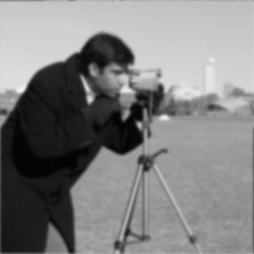

# Maio 2026 — Astrofoto da Lua: desfocando o seeing

## O cenário

Numa quinta à noite em São Paulo, um astrofotógrafo amador monta no quintal um
**telescópio Newtoniano de 130 mm** com uma **ZWO ASI120MM-S** acoplada — uma
câmera CMOS monocromática de 1.2 MP, USB 2.0, sem sistema de resfriamento.
Aponta pra Lua, configura ganho médio, e em 90 segundos captura **3 mil frames
da cratera Tycho** com exposição de 5 ms cada.

No software de processamento ele descobre o que todo mundo no hobby já sabe:
**a maior parte dos frames está borrada**. Não é a câmera mexendo — é o ar.

| Frame que saiu da câmera | Como a foto deveria ser |
|:---:|:---:|
|  |  |

Entre o telescópio e a Lua existem 100 km de atmosfera turbulenta. Cada
camada de ar quente subindo, ar frio descendo, vento cisalhando, age como
uma lente fraca e mal alinhada sobre o caminho óptico. O efeito acumulado
distorce e borra a imagem do mesmo jeito que olhar pra fundo de piscina mexida.
A galera chama esse fenômeno de **seeing**.

O seeing varia frame a frame. Em algumas noites a atmosfera está calma e o
borrão é leve; em outras, ou apontando perto do horizonte, ele é forte. Em
cima disso, a câmera (sem TEC pra esfriar o sensor) ainda adiciona um chiado
fino de ruído eletrônico que aparece como granulação nas áreas escuras do
disco lunar.

## A tarefa

O astrofotógrafo te paga um café se você devolver, pra cada frame ruim, a
melhor estimativa possível de como a foto seria sem atmosfera. Concretamente:
**dado um BMP borrado de 512×512, escrever um BMP do mesmo tamanho com a
versão nítida estimada**.

O desafio é por **qualidade**: quem recupera mais detalhe (maior PSNR) ganha.
O tempo de execução é cap duro — passou disso, desclassifica — mas acima do
cap nada de mais vale. Detalhes na [Spec](#spec) abaixo.

## Spec

### Formato de I/O

- **Entrada (stdin)**: BMP 24-bit, **512×512**, sem compressão, grayscale
  armazenado como R = G = B em cada pixel.
  - 14 bytes `BITMAPFILEHEADER` + 40 bytes `BITMAPINFOHEADER` = 54 bytes
    de cabeçalho, pixels começam no byte 54
  - Linhas de baixo pra cima, BGR por pixel, sem padding (row stride 1536 B)
- **Saída (stdout)**: BMP no exato mesmo formato e dimensões. Pixels fora
  de `[0, 255]` devem ser clipados antes de escrever em `uint8`.

Se você só quer ver o esqueleto da submissão rodando, em [`example/`](example/)
mora um Dockerfile mínimo que lê stdin e escreve stdout sem alterar nada.

### Sem I/O em arquivo

A solução roda em container Docker com:

```
--read-only        # filesystem todo somente-leitura, sem --tmpfs
--network=none     # sem rede
```

Sua solução **não pode escrever em nenhum arquivo**. Apenas stdin de leitura,
stdout/stderr de escrita, e RAM. Tentar escrever em qualquer lugar falha
com `EROFS`.

### Validação (caps duros)

Estourar qualquer um destes desclassifica a submissão:

- **PSNR ≥ 21 dB** contra `expected/<caso>.bmp` em **todos** os casos
  (públicos + ocultos), com `PSNR = 10 · log₁₀(255² / MSE)`.
- **Tempo ≤ 2 000 ms por imagem** (mediana de 5 runs medidos por
  `hyperfine`, +1 warmup). Esse cap é apertado de propósito — Python +
  numpy FFT cabe folgado, mas não dá pra rodar 50 iterações de
  Richardson-Lucy nem inferência de rede pesada.
- `peak_rss_mb ≤ 1024` (1 GB de RSS).

### Ranking

Quem **maximiza o PSNR médio** sobre todos os casos (públicos + ocultos)
ganha. Acima do cap de tempo o tempo não importa — gaste os 2 segundos se
isso te der mais qualidade.

Desempate (em ordem):
1. Mediana de PSNR (caso o médio empate, vence quem é mais consistente)
2. Tempo mediano por imagem (mais rápido vence)
3. Timestamp de submissão (mais cedo vence)

## Como o frame foi gerado

Sua solução pode (e deve) assumir que cada frame de teste foi produzido
**exatamente** pelo processo abaixo:

1. Pega a imagem nítida `nitida` (uint8, 512×512 grayscale).
2. Sorteia um nível de borrão `σ ∈ [1.5, 3.5]` uniformemente (semente
   determinística por imagem). Esse σ controla a "largura" do desfoque —
   1.5 é uma noite excelente em SP, 3.5 é uma noite ruim ou perto do
   horizonte. Você **não sabe** o σ de cada frame.
3. Aplica um borrão gaussiano periódico de largura σ via FFT:
   `borrada = IFFT( FFT(nitida) · FFT(kernel_σ) )`. A convolução é
   **circular** — a borda da imagem se enrola, o frame é tratado como um
   toro 512×512.
4. Soma um ruído branco gaussiano com `σ_n = 2.0` (no domínio 0–255).
5. Clipa em `[0, 255]` e quantiza para `uint8` → arquivo BMP.

O kernel é construído como abaixo (numpy de referência; em outras linguagens,
reproduzir o mesmo layout sob pena de errar a fase da deconvolução):

```python
import numpy as np

def gaussian_psf_freq(shape, sigma):
    h, w = shape
    yy = np.fft.fftfreq(h) * h
    xx = np.fft.fftfreq(w) * w
    yy, xx = np.meshgrid(yy, xx, indexing="ij")
    psf = np.exp(-(xx**2 + yy**2) / (2 * sigma**2))
    psf /= psf.sum()
    return np.fft.fft2(psf)
```

Equivalente: kernel gaussiano centrado em `(0, 0)`, periodicidade implícita
512, normalizado pra somar 1 no domínio espacial.

## A referência

Em [`reference/wiener.py`](reference/wiener.py) mora um solver
**intencionalmente burro**: aplica o filtro de Wiener com σ fixo = 2.5 (o
ponto médio da faixa) e regularização λ = 0.005 (calibrada pro nível de
ruído). Quando o σ verdadeiro é próximo de 2.5 ele sai bem; quando é 1.5
ou 3.5, sofre. Passa raspando do threshold no caso mais difícil
(mandrill, ~21.8 dB).

A referência **não estima** σ. Sua solução deve fazer melhor. Algumas
direções:

- **Estimar σ a partir do espectro de potência** (técnica clássica:
  `log P(f) ≈ -2π²σ²f² - α log(f) + c`, ajusta linear)
- **Sweep paralelo** sobre alguns σ candidatos + escolha por métrica de
  foco (variância do laplaciano, total variation, gradient sparsity)
- **Métodos iterativos** (Richardson-Lucy, TV-regularizado)

## Dataset público

9 imagens clássicas de processamento, todas normalizadas para 512×512
grayscale. Originais em `reference/originals/` (gerado on-demand pelo
script de geração, não commitado).

| Slug | Imagem | Origem |
|---|---|---|
| `cameraman` | The Cameraman | MIT (via skimage.data) |
| `mandrill` | Mandrill (Baboon) | USC-SIPI 4.2.03 |
| `peppers` | Peppers | USC-SIPI 4.2.07 |
| `airplane` | F-16 Airplane | USC-SIPI 4.2.05 |
| `lake` | Sailboat on Lake | USC-SIPI 4.2.06 |
| `boat` | Boat | USC-SIPI boat.512 |
| `house` | House | USC-SIPI 4.1.05 (upscaled) |
| `couple` | Couple | USC-SIPI 5.2.08 |
| `stream` | Stream and bridge | USC-SIPI 5.2.10 |

`inputs/<slug>.bmp` é o frame "saído da câmera" (borrado + ruidoso).
`expected/<slug>.bmp` é o ground truth (a imagem nítida — você não tem
isso na prática, é só pra validar localmente).

> **Mandrill** é o caso mais difícil: a textura fina dos pelos do focinho
> gera ruído de alta frequência onde o seeing comeu o sinal mais útil.
> Se não passar do threshold no mandrill, é onde começar a debugar.

Existem **casos ocultos** adicionais que só são revelados quando o desafio
encerra. Mesmo formato, mesmo modelo direto, σ sorteado da mesma faixa.

## Como testar localmente

Pré-requisitos: `uv` (Python 3.11+), `docker`, `hyperfine`, `jq`.

```bash
# 1. Gerar o dataset (cache em reference/originals/, faz a parte de rede uma vez)
uv run python 2026-05-deblur/reference/generate.py

# 2. Rodar a referência num caso e conferir o PSNR
uv run python 2026-05-deblur/reference/wiener.py \
    < 2026-05-deblur/inputs/cameraman.bmp \
    > /tmp/cameraman_out.bmp

uv run python 2026-05-deblur/reference/score.py \
    /tmp/cameraman_out.bmp \
    2026-05-deblur/expected/cameraman.bmp
# → algo tipo "26.2221"
```

Pra rodar o bench harness contra a referência (precisa de `docker`):

```bash
docker build -t acelerado-ref:bench 2026-05-deblur/reference/
2026-05-deblur/bench/run.sh 2026-05-deblur/reference/
```

## Como submeter

Veja [`../SUBMISSION.md`](../SUBMISSION.md). TL;DR:

1. `solutions/<seu-usuario>/Dockerfile` constrói sua solução
2. Container lê BMP de stdin, escreve BMP em stdout — sem escrever nenhum
   arquivo
3. PR contra a branch `submissions/<seu-usuario>` ou `main` (público)

Se quiser um ponto de partida que já compila e roda sem fazer nada útil,
copie [`example/`](example/) e substitua o conteúdo pela sua lógica.

## Atribuição

Imagens de teste do **USC-SIPI** (University of Southern California, Signal
and Image Processing Institute, "for research and educational use") e do
**MIT** (Cameraman, via `skimage.data`).
