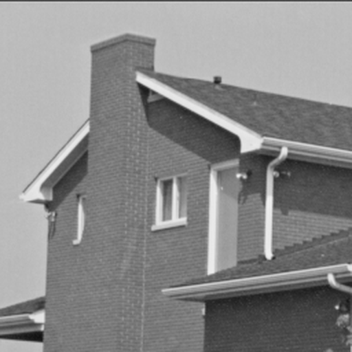

# Maio 2026 — Drone amador: desfocando o autofoco ruim

## O cenário

Você comprou um drone amador FPV de menos de R$ 2 mil — câmera CMOS
monocromática de 1.2 MP, lente plástica de baixo custo, **autofoco contínuo
barato e sem gimbal de qualidade**. Sai numa tarde de domingo filmando a
chácara dos pais: o lago atrás da casa, a ponte do riacho, o telhado novo.
Em 90 segundos de voo, a câmera grava **3 mil frames** com exposição de 5 ms
cada.

No software de processamento você descobre o que a comunidade já sabe:
**a maior parte dos frames está borrada**. Não é vento e nem tremida — é o
**autofoco do bagulho**.

| Frame que saiu do drone | Como a foto deveria ser |
|:---:|:---:|
|  |  |

A lente do drone tem autofoco contínuo: a cada frame o sensor recalcula
onde focar, e como o algoritmo é ruim ele **erra de forma diferente cada
vez**. Em algumas tomadas pega quase certo; em outras, fica bem fora de
foco. O efeito é um **borrão aproximadamente gaussiano** cuja intensidade
depende de quanto o autofoco errou naquele frame específico. Em cima disso,
o sensor (sem resfriamento, ganho médio) ainda adiciona um chiado fino de
ruído eletrônico que aparece como granulação nas áreas escuras das sombras.

## A tarefa

Você quer recuperar a melhor estimativa possível da imagem nítida pra cada
frame ruim. Concretamente:
**dado um BMP borrado de 512×512, escrever um BMP do mesmo tamanho com a
versão nítida estimada**.

O desafio é por **qualidade**: quem recupera mais detalhe (maior PSNR) ganha.
O tempo de execução é cap duro — passou disso, desclassifica — mas acima do
cap nada de mais vale. Detalhes na [Spec](#spec) abaixo.

## Spec

### Formato de I/O

- **Entrada (stdin)**: BMP 24-bit, **512×512**, sem compressão, grayscale
  armazenado como R = G = B em cada pixel.
  - 14 bytes `BITMAPFILEHEADER` + 40 bytes `BITMAPINFOHEADER` = 54 bytes
    de cabeçalho, pixels começam no byte 54
  - Linhas de baixo pra cima, BGR por pixel, sem padding (row stride 1536 B)
- **Saída (stdout)**: BMP no exato mesmo formato e dimensões. Pixels fora
  de `[0, 255]` devem ser clipados antes de escrever em `uint8`.

Se você só quer ver o esqueleto da submissão rodando, em [`example/`](example/)
moram Dockerfiles mínimos passthrough em **Python, JS, C, C++, Rust, Go e
Zig** — escolhe a linguagem, copia, troca a lógica.

### Como o harness roda sua solução

```bash
docker run --rm \
  --cpuset-cpus=2,3 --cpus=2 \
  --memory=1g \
  --network=none --read-only \
  -i <sua-imagem> < inputs/<caso>.bmp > out.bmp
```

Sua solução **não pode escrever em nenhum arquivo**. Apenas stdin de leitura,
stdout/stderr de escrita, e RAM. Tentar escrever em qualquer lugar (incluindo
`/tmp`, `~/.cache`, `/var/log`) falha com `EROFS`.

Dicas pra não bater nessa parede:

- **Python**: rode com `python -B` (ou `PYTHONDONTWRITEBYTECODE=1`) pra não
  tentar escrever `.pyc`. Bibliotecas que cacheiam em `~/.cache` (matplotlib,
  numba JIT, etc.) podem falhar — pré-construa os caches no `Dockerfile`,
  não em runtime, ou use só `numpy` puro.
- **C/C++ com FFTW**: `fftw_wisdom` por default escreve em arquivo. Use
  apenas o wisdom embutido no binário ou desligue persistência.
- **GPU**: indisponível no bench (não tem GPU no host).

### Validação (caps duros)

Estourar qualquer um destes desclassifica a submissão:

- **PSNR ≥ 21 dB** contra `expected/<caso>.bmp` em **todos** os casos
  (públicos + ocultos), com `PSNR = 10 · log₁₀(255² / MSE)`.
- **Tempo ≤ 2 000 ms por imagem** (mediana de 5 runs medidos por
  `hyperfine`, +1 warmup). Esse cap é apertado de propósito — Python +
  numpy FFT cabe folgado, mas não dá pra rodar 50 iterações de
  Richardson-Lucy nem inferência de rede pesada.
- `peak_rss_mb ≤ 1024` (1 GB de RSS).

### Ranking

Quem **maximiza o PSNR médio** sobre todos os casos (públicos + ocultos)
ganha. Acima do cap de tempo o tempo não importa — gaste os 2 segundos se
isso te der mais qualidade.

Desempate (em ordem):
1. Mediana de PSNR (caso o médio empate, vence quem é mais consistente)
2. Tempo mediano por imagem (mais rápido vence)
3. Timestamp de submissão (mais cedo vence)

## Como o frame foi gerado

Sua solução pode (e deve) assumir que cada frame de teste foi produzido
**exatamente** pelo processo abaixo:

1. Pega a imagem nítida `nitida` (uint8, 512×512 grayscale).
2. Sorteia um nível de borrão `σ ∈ [1.5, 3.5]` uniformemente (semente
   determinística por imagem). Esse σ controla a "largura" do desfoque —
   1.5 é o autofoco quase acertando, 3.5 é o autofoco totalmente perdido.
   Você **não sabe** o σ de cada frame.
3. Aplica um borrão gaussiano periódico de largura σ via FFT:
   `borrada = IFFT( FFT(nitida) · FFT(kernel_σ) )`. A convolução é
   **circular** — a borda da imagem se enrola, o frame é tratado como um
   toro 512×512.
4. Soma um ruído branco gaussiano com `σ_n = 2.0` (no domínio 0–255).
5. Clipa em `[0, 255]` e quantiza para `uint8` → arquivo BMP.

O kernel é construído como abaixo (numpy de referência; em outras linguagens,
reproduzir o mesmo layout sob pena de errar a fase da deconvolução):

```python
import numpy as np

def gaussian_psf_freq(shape, sigma):
    h, w = shape
    yy = np.fft.fftfreq(h) * h
    xx = np.fft.fftfreq(w) * w
    yy, xx = np.meshgrid(yy, xx, indexing="ij")
    psf = np.exp(-(xx**2 + yy**2) / (2 * sigma**2))
    psf /= psf.sum()
    return np.fft.fft2(psf)
```

Equivalente: kernel gaussiano centrado em `(0, 0)`, periodicidade implícita
512, normalizado pra somar 1 no domínio espacial.

## A referência

Em [`reference/wiener.py`](reference/wiener.py) mora um solver
**intencionalmente burro**: aplica o filtro de Wiener com σ fixo = 2.5 (o
ponto médio da faixa) e regularização λ = 0.005 (calibrada pro nível de
ruído). Quando o σ verdadeiro é próximo de 2.5 ele sai bem; quando é 1.5
ou 3.5, sofre — é a forma mais ingênua de atacar o problema "cego".

A referência **não estima** σ. Sua solução deve fazer melhor. Algumas
direções:

- **Estimar σ a partir do espectro de potência** (técnica clássica:
  `log P(f) ≈ -2π²σ²f² - α log(f) + c`, ajusta linear)
- **Sweep paralelo** sobre alguns σ candidatos + escolha por métrica de
  foco (variância do laplaciano, total variation, gradient sparsity)
- **Métodos iterativos** (Richardson-Lucy, TV-regularizado)

## Dataset público

5 imagens de paisagem/aérea normalizadas para 512×512 grayscale. Originais
em `reference/originals/` (gerado on-demand pelo script de geração, não
commitado).

| Slug | Imagem | Origem |
|---|---|---|
| `airplane` | F-16 Airplane (top-down) | USC-SIPI 4.2.05 |
| `lake` | Sailboat on Lake | USC-SIPI 4.2.06 |
| `boat` | Boat | USC-SIPI boat.512 |
| `house` | House | USC-SIPI 4.1.05 (upscaled) |
| `stream` | Stream and bridge | USC-SIPI 5.2.10 |

`inputs/<slug>.bmp` é o frame "saído do drone" (borrado + ruidoso).
`expected/<slug>.bmp` é o ground truth (a imagem nítida — você não tem
isso na prática, é só pra validar localmente).

> **Stream** tende a ser o caso mais difícil: a textura fina da água e da
> folhagem gera alta frequência onde o defocus comeu o sinal mais útil.
> Se não passar do threshold em `stream`, é onde começar a debugar.

## Dataset oculto

Os casos do benchmark final são **outras imagens de paisagem aérea do
mesmo gênero** (mais fotos USC-SIPI das categorias *aerial* e *misc*, no
mesmo formato 512×512, processadas pelo mesmo modelo direto descrito
acima, com σ sorteado da mesma faixa `[1.5, 3.5]`). Estatística similar
ao público — o set oculto não é uma pegadinha, é só *mais do mesmo*. Se
sua solução vai bem nos 5 públicos, deve ir bem nos ocultos também.

## Como testar localmente

Pré-requisitos: `uv` (Python 3.11+), `docker`, `hyperfine`, `jq`.

```bash
# 1. Gerar o dataset (cache em reference/originals/, faz a parte de rede uma vez)
uv run python 2026-05-deblur/reference/generate.py

# 2. Rodar a referência num caso e conferir o PSNR
uv run python 2026-05-deblur/reference/wiener.py \
    < 2026-05-deblur/inputs/house.bmp \
    > /tmp/house_out.bmp

uv run python 2026-05-deblur/reference/score.py \
    /tmp/house_out.bmp \
    2026-05-deblur/expected/house.bmp
# → algo tipo "26.2221"
```

Pra rodar o bench harness contra a referência (precisa de `docker`):

```bash
docker build -t acelerado-ref:bench 2026-05-deblur/reference/
2026-05-deblur/bench/run.sh 2026-05-deblur/reference/
```

## Como submeter

Estrutura, `meta.json` e fluxo de PR ficam no [`../SUBMISSION.md`](../SUBMISSION.md)
genérico. Pra esse desafio especificamente:

1. `2026-05-deblur/solutions/<seu-usuario>/Dockerfile` constrói sua solução
2. Container lê BMP de stdin, escreve BMP em stdout (contrato acima)
3. PR contra a branch `submissions/<seu-usuario>` ou `main` (público)

Se quiser um ponto de partida que já compila e roda sem fazer nada útil,
copie a subpasta da linguagem desejada de [`example/`](example/) e substitua
o conteúdo pela sua lógica.

## Atribuição

Imagens de teste do **USC-SIPI** (University of Southern California, Signal
and Image Processing Institute, "for research and educational use").
